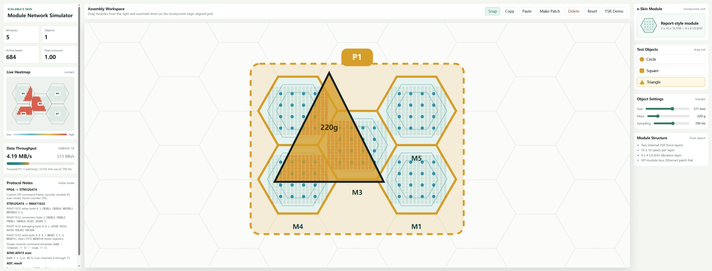
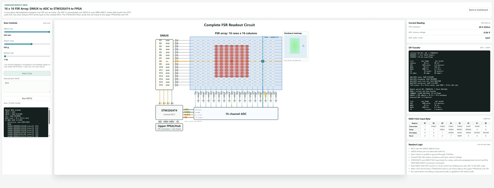
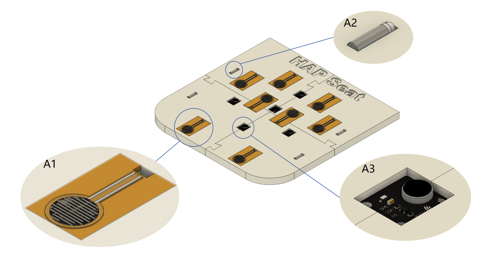
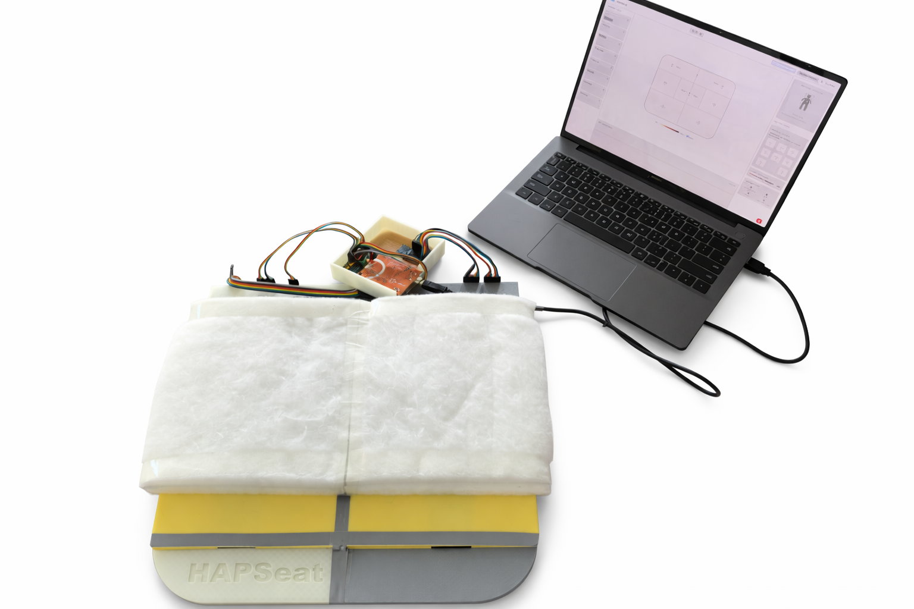
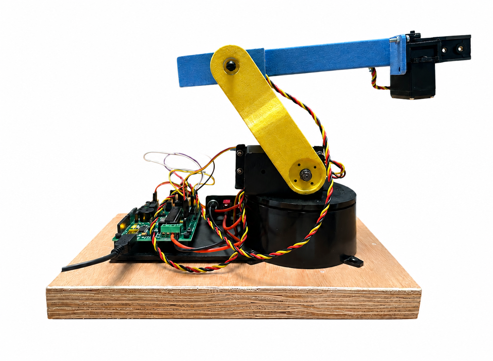

# Hi, I'm Yange Sun（你好，我是孙砚戈）👋

### MSc Human & Biological Robotics @ Imperial College London（帝国理工学院 Human & Biological Robotics 硕士生）

**Human-Robot Interaction · Rehabilitation Robotics · Robot Manipulation · Bio-signal Processing · Tactile Sensing**

**人机交互 · 康复机器人 · 机器人操作 · 生物信号处理 · 触觉感知**

---

## About Me（关于我）

I am an MSc student in **Human and Biological Robotics** at **Imperial College London**, with a BEng in **Electrical and Electronic Engineering** from **University College London**.

My background combines **classical robotics, biomechanics, control theory, neuroscience, machine learning, reinforcement learning, embedded systems, and biological-signal analysis**. I am particularly interested in building robotic systems that can better understand, assist, and interact with humans.

My research interests include:

- **Human-Robot Interaction**
- **Rehabilitation robotics and assistive devices**
- **Robot manipulation and teleoperation**
- **Tactile sensing and haptic feedback**
- **Neural decoding and brain-machine interfaces**
- **sEMG-based human-machine interfaces**
- **Reinforcement learning for robotic decision-making**
- **Human behavior data and intention-driven control**

我目前就读于 **Imperial College London 人类与生物机器人硕士项目**，本科毕业于 **University College London 电子与电气工程专业**。

我的背景结合了 **传统机器人学、生物力学、控制理论、神经科学、机器学习、强化学习、嵌入式系统和生物信号分析**。我尤其关注如何让机器人更自然地理解人类、辅助人类，并与人类进行高效交互。

我目前感兴趣的研究方向包括：

- **人机交互**
- **康复机器人与辅助设备**
- **机器人操作与遥操作**
- **触觉感知与力/触觉反馈**
- **神经解码与脑机接口**
- **基于 sEMG 的人机接口**
- **用于机器人决策的强化学习方法**
- **人类行为数据与意图驱动控制**

---

## Research & Engineering Focus（研究与工程方向）

<table>
  <tr>
    <td width="50%">
      <h3>🤝 Human-Robot Interaction（人机交互）</h3>
      

      I am interested in how robots can interpret human intention, respond to human behavior, and provide physical or sensory assistance in a natural, adaptive, and reliable way.
      

      

      我关注机器人如何理解人类意图、响应人类行为，并以自然、自适应且可靠的方式提供物理或感知层面的辅助。
      

    </td>
    <td width="50%">
      <h3>🦾 Rehabilitation & Assistive Robotics（康复与辅助机器人）</h3>
      

      I work on assistive systems for posture monitoring, rehabilitation feedback, sensorimotor guidance, and wearable human-centered support.
      

      

      我研究用于姿态监测、康复反馈、感觉运动引导和可穿戴辅助的人本机器人系统。
      

    </td>
  </tr>
  <tr>
    <td width="50%">
      <h3>🧠 Neural & Bio-signal Interfaces（神经与生物信号接口）</h3>
      

      My projects involve neural spike decoding, sEMG-based gesture recognition, myoelectric control, and intention-driven assistive control.
      

      

      我的项目涉及神经脉冲解码、基于 sEMG 的手势识别、肌电控制和意图驱动的辅助控制。
      

    </td>
    <td width="50%">
      <h3>🤖 Robot Manipulation & Learning（机器人操作与学习）</h3>
      

      I am interested in combining robot kinematics, calibration, trajectory planning, reinforcement learning, and biological inspiration for safer and more intelligent robotic behavior.
      

      

      我希望结合机器人运动学、标定、轨迹规划、强化学习和生物启发方法，让机器人具备更安全、更智能的行为能力。
      

    </td>
  </tr>
</table>

---

## Education（教育背景）

### Imperial College London（帝国理工学院）  
**MSc in Human and Biological Robotics, Biomedical Engineering**  
**2025 – 2026 | London, UK**

Relevant coursework:

- Human-Centered Design of Assistive and Rehabilitation Devices
- Brain Machine Interfaces
- Human Neuromechanical Control and Learning
- Reinforcement Learning
- Data Analysis

相关课程：

- 辅助与康复设备的人本设计
- 脑机接口
- 人类神经机械控制与学习
- 强化学习
- 数据分析

---

### University College London（伦敦大学学院）  
**BEng in Electrical and Electronic Engineering**  
**First-Class Honours, Top 20%**  
**2022 – 2025 | London, UK**

Relevant coursework:

- Robotic Systems
- Reinforcement Learning
- Artificial Intelligence
- Machine Learning and Neural Computing
- Programming and Control Systems
- Mathematical Modeling and Analysis
- Analog Electronics
- Digital Circuit Design

相关课程：

- 机器人系统
- 强化学习
- 人工智能
- 机器学习与神经计算
- 编程与控制系统
- 数学建模与分析
- 模拟电子
- 数字电路设计

---

## Featured Projects（代表项目）

---

### 🧩 Scalable Electronics for Modular Multi-Layer Robotic E-Skin（模块化多层机器人电子皮肤的可扩展电子系统）

**Keywords:** Robotic e-skin · tactile sensing · haptic feedback · teleoperation · wearable rehabilitation devices · multi-contact HRI  
**关键词：** 机器人电子皮肤 · 触觉感知 · 触觉反馈 · 遥操作 · 可穿戴康复设备 · 多接触人机交互

I am currently conducting my MSc thesis within the [Human Robotics Group](https://www.imperial.ac.uk/human-robotics/) at **Imperial College London**. This project develops scalable electronics for modular multi-layer robotic e-skin, aiming to support distributed tactile sensing and tactile feedback in robotic manipulation, teleoperation, and wearable rehabilitation systems.

我目前在 **Imperial College London** 的 [Human Robotics Group](https://www.imperial.ac.uk/human-robotics/) 进行硕士毕业设计。该项目面向模块化多层机器人电子皮肤，开发可扩展电子系统，用于支持机器人操作、遥操作和可穿戴康复设备中的分布式触觉感知与触觉反馈。

  
  

Main work:

- Developing scalable electronics for modular multi-layer electronic skin
- Designing a miniaturized five-module e-skin patch
- Building a hierarchical **host–patch–module** architecture
- Supporting synchronized multimodal sensing and data aggregation
- Exploring future multi-patch deployment
- Addressing bandwidth, power distribution, calibration repeatability, and maintainable hardware integration
- Supporting future multi-contact human-robot interaction scenarios

主要工作：

- 开发面向模块化多层电子皮肤的可扩展电子系统
- 设计小型化五模块 e-skin patch
- 构建分层式 **host–patch–module** 架构
- 支持同步多模态感知与数据聚合
- 探索未来多 patch 系统部署
- 解决通信带宽、供电、校准重复性和硬件集成维护问题
- 面向未来多接触人机交互场景进行系统设计

---

### 🪑 Programmable Haptic-Guided Rehabilitation Cushion — HAPSeat（可编程触觉引导康复坐垫）

**Keywords:** Haptic feedback · posture monitoring · FSR sensing · rehabilitation feedback · human behavior data · sensorimotor guidance  
**关键词：** 触觉反馈 · 姿态监测 · FSR 压力传感 · 康复反馈 · 人类行为数据 · 感觉运动引导

HAPSeat is a programmable assistive cushion designed for posture monitoring and rehabilitation feedback. It converts seated human behavior into structured pressure-distribution data and provides real-time vibrotactile guidance.

HAPSeat 是一个用于姿态监测和康复反馈的可编程辅助坐垫。它可以将坐姿行为转化为结构化压力分布数据，并通过实时振动反馈进行引导。

  
  

Main work:

- Co-developed a programmable assistive cushion using **8 FSR pressure sensors**
- Built Arduino-based data acquisition
- Implemented multiplexer-based sensor readout
- Controlled PWM-driven vibration motors for real-time tactile feedback
- Developed adaptive signal conditioning, pressure-distribution analysis, posture classification, visual heatmap rendering, and vibrotactile cue generation
- Programmed feedback modes for left-right asymmetry correction, anti-slumping guidance, and movement encouragement
- Supported posture correction, sensorimotor guidance, and scoliosis-oriented posture monitoring
- Designed the system as an algorithmically reconfigurable rehabilitation platform for future post-stroke coordination training and target-posture prediction

主要工作：

- 共同开发使用 **8 个 FSR 压力传感器** 的可编程辅助坐垫
- 搭建基于 Arduino 的数据采集系统
- 实现基于多路复用器的传感器读取
- 使用 PWM 驱动振动马达，实现实时触觉反馈
- 构建自适应信号调理、压力分布分析、姿态分类、可视化热图渲染和振动触觉提示流程
- 设计左右不对称矫正、防塌腰引导和运动鼓励等反馈模式
- 支持姿态矫正、感觉运动引导和面向脊柱侧弯的姿态监测
- 将系统设计为可算法重构的康复平台，用于未来中风后协调训练和目标姿态预测

---

### 🧠 Hybrid Neural Decoder for Hand Trajectory Estimation（面向手部轨迹估计的混合神经解码器）

**Keywords:** BCI · neural decoding · spike trains · low-latency inference · rehabilitation control · intention-driven control  
**关键词：** 脑机接口 · 神经解码 · 脉冲序列 · 低延迟推理 · 康复控制 · 意图驱动控制

This project developed a causal online BCI decoder to reconstruct 2-D hand trajectories from motor-cortical spike trains for prosthetic and rehabilitation-control applications.

该项目开发了一个因果在线脑机接口解码器，用于从运动皮层神经脉冲信号中重建二维手部轨迹，面向假肢控制和康复控制应用。

Highlights:

- Ranked **9/30 in RMSE**
- Ranked **1/30 in total training and prediction time**
- Achieved official hidden-test RMSE of **8.686**
- Achieved runtime of **0.602 s**
- Processed **98-unit spike activity**
- Used **20 ms causal binning**
- Demonstrated a lightweight neural decoding approach for intention-driven assistive control

项目亮点：

- RMSE 排名 **9/30**
- 总训练与预测时间排名 **1/30**
- 官方隐藏测试 RMSE 为 **8.686**
- 运行时间为 **0.602 s**
- 处理 **98 个神经元单元的脉冲活动**
- 使用 **20 ms 因果分箱**
- 展示了一种面向意图驱动辅助控制的轻量级神经解码方法

Methods:

- Time-bin LDA direction inference
- Top-K trajectory priors
- Ridge-regression displacement estimation
- Sigmoid fusion
- Angular constraints

方法包括：

- 基于时间分箱的 LDA 方向推断
- Top-K 轨迹先验
- 岭回归位移估计
- Sigmoid 融合
- 角度约束

---

### ⚡ DQN-Based Gesture Recognition Using sEMG Signals（基于 sEMG 信号的 DQN 手势识别）

**Keywords:** Deep reinforcement learning · sEMG · gesture recognition · myoelectric control · HMI  
**关键词：** 深度强化学习 · 表面肌电信号 · 手势识别 · 肌电控制 · 人机接口

This project reformulates sEMG-based gesture recognition as a sequential decision-making problem for human-machine interaction.

该项目将基于 sEMG 的手势识别重新建模为一个面向人机交互的序列决策问题。

Main work:

- Developed a Deep Q-Network framework for sEMG-based gesture recognition
- Designed a 1D CNN-based Q-network
- Built a custom MDP environment
- Used experience replay, epsilon-greedy exploration, and a fixed target network
- Learned from noisy multi-channel muscle signals
- Evaluated the influence of input channel count, action-space dimensionality, and data volume
- Found that higher channel counts improved learning stability, while gesture complexity limited performance

主要工作：

- 构建基于 DQN 的 sEMG 手势识别框架
- 设计基于 1D CNN 的 Q-network
- 构建自定义 MDP 环境
- 使用经验回放、epsilon-greedy 探索和固定目标网络
- 从噪声较强的多通道肌肉信号中进行学习
- 分析输入通道数、动作空间维度和数据量对性能的影响
- 发现更多通道可以提升学习稳定性，但复杂手势会限制性能表现

---

### 🧭 Reinforcement Learning for Safe Navigation in Robotic Systems（面向机器人安全导航的强化学习方法）

**Keywords:** Path planning · MDP · Q-learning · robot navigation · policy optimization · model-free reinforcement learning  
**关键词：** 路径规划 · 马尔可夫决策过程 · Q-learning · 机器人导航 · 策略优化 · 无模型强化学习

This project implemented and compared classical search, dynamic programming, Monte Carlo, TD learning, and Q-learning methods for robotic navigation under weighted terrain constraints.

该项目实现并比较了经典搜索、动态规划、蒙特卡洛、TD 学习和 Q-learning 等方法，用于带权重地形约束下的机器人导航。

Main work:

- Implemented BFS, DFS, Dijkstra, and A*
- Evaluated path cost, explored cells, and route efficiency
- Modeled stochastic robot navigation as a finite MDP
- Implemented policy iteration and value iteration
- Compared Monte Carlo, TD(0), and Q-learning
- Analyzed the effects of discount factors, transition probabilities, epsilon-greedy exploration rates, and learning rates
- Explored safe navigation strategies for robotic platforms

主要工作：

- 实现 BFS、DFS、Dijkstra 和 A*
- 评估路径代价、搜索网格数量和路线效率
- 将随机机器人导航建模为有限 MDP
- 实现策略迭代和值迭代
- 比较蒙特卡洛、TD(0) 和 Q-learning
- 分析折扣因子、转移概率、epsilon-greedy 探索率和学习率对收敛的影响
- 探索面向机器人平台的安全导航策略

---

### 🤖 Vision-Guided Robotic Grasping with Kinematics and Calibration（基于视觉引导、运动学和标定的机器人抓取）

**Keywords:** Robot manipulation · camera calibration · inverse kinematics · trajectory planning · Arduino control  
**关键词：** 机器人操作 · 相机标定 · 逆运动学 · 轨迹规划 · Arduino 控制

This project built a MATLAB-based workflow to localize an object under a fixed overhead camera and guide a 3-DOF RRR robotic arm to grasp it.

该项目构建了一个基于 MATLAB 的流程，用固定俯视相机定位目标物体，并引导 3-DOF RRR 机械臂完成抓取。

  

Main work:

- Built a MATLAB-based robotic grasping workflow
- Calibrated the camera using checkerboard images
- Converted detected object pixels into robot-frame coordinates
- Derived forward kinematics for workspace modeling
- Used inverse kinematics to compute target joint angles
- Planned end-effector trajectories from the current pose to the detected object position
- Validated predicted joint commands through Arduino-controlled manipulation experiments

主要工作：

- 构建基于 MATLAB 的机器人抓取流程
- 使用棋盘格图像完成相机标定
- 将检测到的物体像素坐标转换到机器人坐标系
- 推导正运动学用于工作空间建模
- 使用逆运动学计算目标关节角
- 规划末端执行器从当前位置到目标物体位置的轨迹
- 通过 Arduino 控制实验验证预测关节指令

---

## Technical Skills（技术能力）

### Programming（编程语言）

---

### Robotics, AI & Signal Processing（机器人、人工智能与信号处理）

---

### Hardware & Tools（硬件与工具）

---

## Current Research Direction（当前研究方向）

I am currently exploring how robotic systems can better integrate **human intention, tactile information, biological signals, physical interaction, and adaptive control**.

我目前正在探索机器人系统如何更好地融合 **人类意图、触觉信息、生物信号、物理交互和自适应控制**。

My long-term goal is to build human-centered robotic systems that are:

我的长期目标是构建具备以下特点的人本机器人系统：

- **Interactive** — able to understand and respond to human behavior  
  **具备交互能力** —— 能够理解并响应人类行为

- **Assistive** — useful for rehabilitation, support, and daily assistance  
  **具备辅助能力** —— 能用于康复、支持和日常辅助

- **Adaptive** — able to learn from human signals and changing environments  
  **具备自适应能力** —— 能从人类信号和环境变化中学习

- **Embodied** — grounded in physical sensing, movement, contact, and feedback  
  **具备具身能力** —— 建立在真实感知、运动、接触和反馈之上

---

## GitHub Overview（GitHub 数据概览）

---

## Selected Keywords（关键词）

`Human-Robot Interaction` · `Rehabilitation Robotics` · `Robot Manipulation` · `Tactile Sensing` · `Haptics`  
`Teleoperation` · `Brain-Machine Interface` · `Neural Decoding` · `sEMG` · `Reinforcement Learning` · `Embedded Systems`

`人机交互` · `康复机器人` · `机器人操作` · `触觉感知` · `力触觉反馈`  
`遥操作` · `脑机接口` · `神经解码` · `表面肌电` · `强化学习` · `嵌入式系统`

---

### Thanks for visiting my profile（感谢访问我的主页）

**Building intelligent robotic systems for human-centered interaction, assistance, and rehabilitation.**

**致力于构建面向人机交互、辅助与康复的智能机器人系统。**

